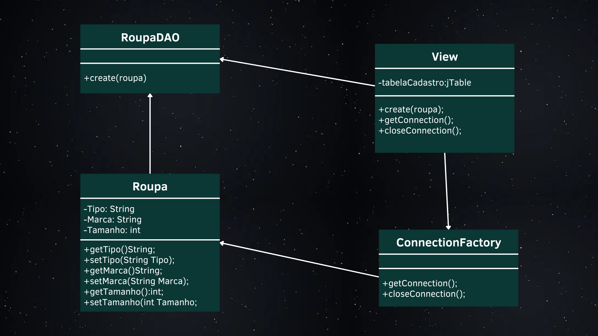
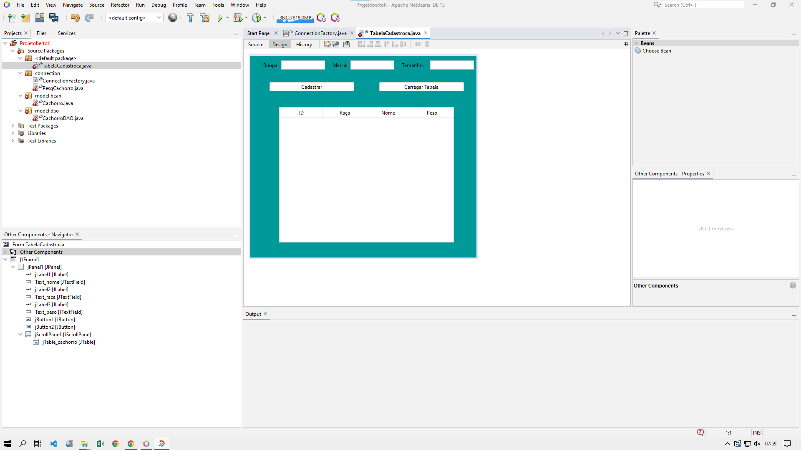
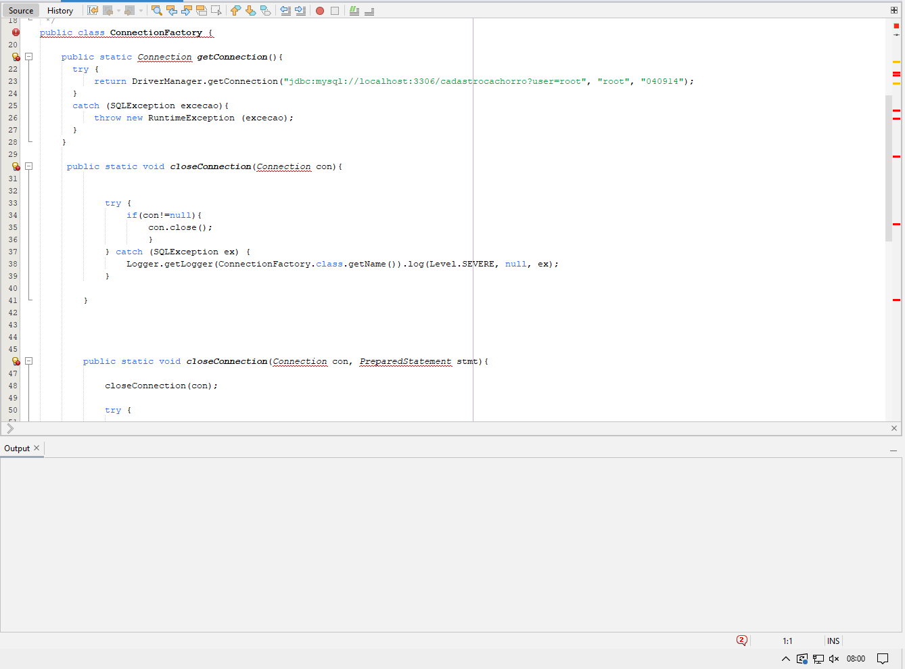
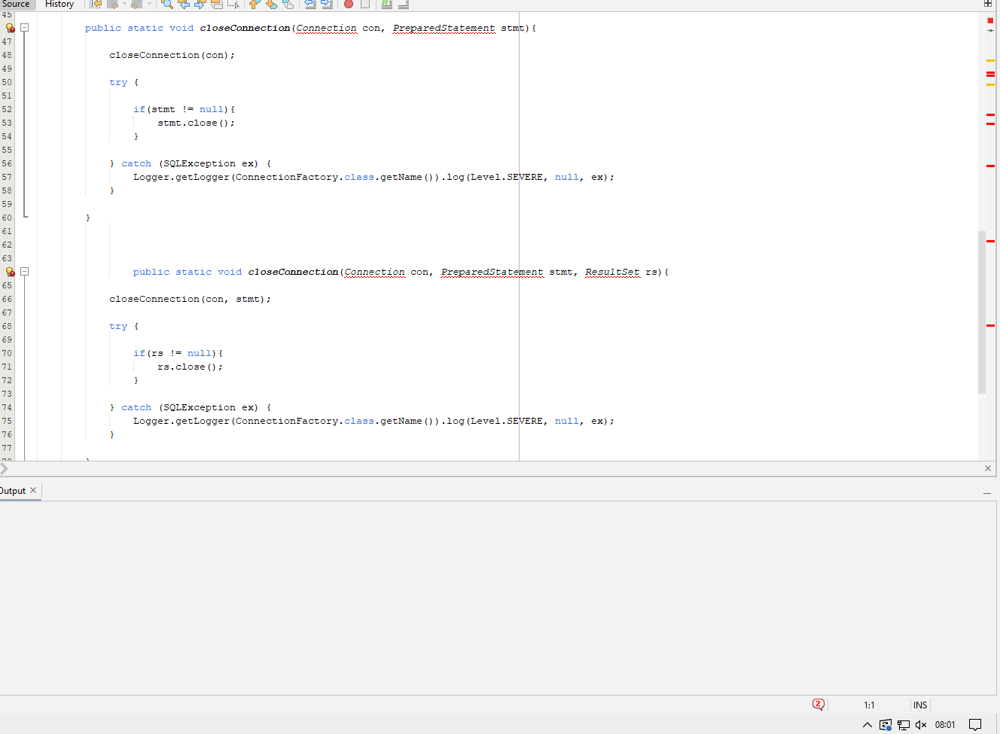
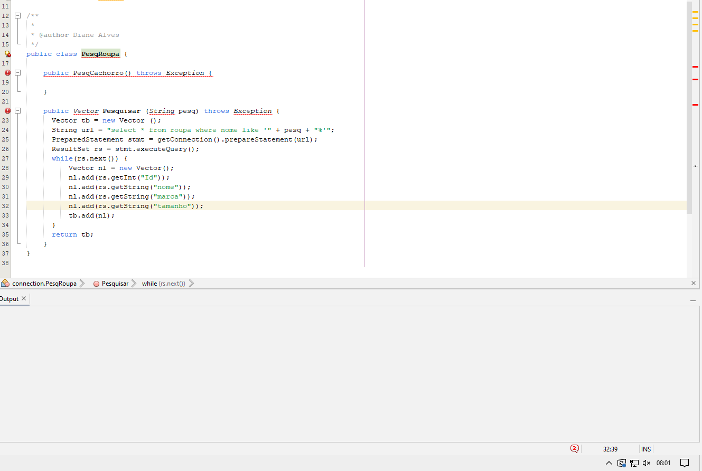

<h2><b>Atividade: Comente sobre o texto</b></h2>

<i>"We see three critical differences between programming and software engineering: time, scale, and the trade-offs at play. On a software engineering project, engineers need to be more concerned with the passage of time and the eventual need for change. In a software engineering organization, we need to be more concerned about scale and efficiency, both for the software we produce as well as for the organization that is producing it. Finally, as software engineers, we are asked to make more complex decisions with higher-stakes outcomes, often based on imprecise estimates of time and growth. Within Google, we sometimes say, “Software engineering is programming integrated over time.” Programming is certainly a significant part of software engineering: after all, programming is how you generate new software in the first place. If you accept this distinction, it also becomes clear that we might need to delineate between programming tasks (development) and software engineering tasks (development, modification, maintenance). The addition of time adds an important new dimension to programming. Cubes aren’t squares, distance isn’t velocity. Software engineering isn’t programming."

Titus Winters, Software Engineering at Google</i>

<h3>Comentário</h3>

Com o texto acima, pode-se perceber que a engenharia de software e a programação estão relacionadas e devem ser trabalhadas juntas. A engenharia pode coletar diferentes requisitos, planejar as entregas, realizar cálculos dos valores, projetar o sistema e implementar um código fonte. A programação, por sua vez, é o caminho que leva a criação de um programa por meio da escrita, testes e manutenção dos programas. Sendo assim, é importante que antes de  criar uma aplicação haja um planejamento e que responda perguntas como: “A aplicação envelhecerá bem? Será necessário realizar atualizações? Ela atinge os requisitos propostos?”. Dessa forma, o programa terá mais chances de ter sucesso e atingir os objetivos propostos.

 

<h2><b>O uso do trade-off no API</b></h2>

 

O trade-off se trata da priorização de cada ferramenta para o desenvolvimento das tarefas de acordo com os requisitos demandados pelo projeto. Sendo assim, é de extrema importância a utilização da melhor ferramenta possível para determinadas funcionalidades, já que essa escolha deixará de fora outras ferramentas. E no desenvolvimento do API não é diferente. Para nós, estudantes da área da tecnologia da informação, o estudo e a análise de cada aplicação deve ser realizada visando as vantagens e desvantagens de usa-lá, dependendo sempre dos requisitos e do objetivo proposto.

 

<h2><b>Requisitos</b></h2>

<h3><b>Sistema de vendas de roupas</b></h3>

> **Funcionais:**

- Cadastrar Roupas de Loja
- Verificar Roupas Cadastradas

 

> **Não Funcionais:**

- Protocolo de Segurança
- Portatibilidade
- Intuitiva

 

<h2><b>Casos de Uso</b></h2>

 

<h2><b>Diagrama de Classe</b></h2>

<h3><b>Código e Funcionamento</b></h3>

