<h1 align="center"><b>As Heurísticas de Nielsen</b></h2>

<ul>
  <li>1- <a href="#1-heurista">Visibilidade do status do sistema</a>
  <li>2- <a href="#2-heurista">Correspondência entre o sistema e o mundo real</a>
  <li>3- <a href="#3-heurista">Controle e liberdade do usuário</a>
  <li>4- <a href="#4-heurista">Consistência e padrões</a>
  <li>5- <a href="#5-heurista">Prevenção de erros</a>
  <li>6- <a href="#6-heurista">Reconhecimento em vez de lembrança</a>
  <li>7- <a href="#7-heurista">Flexibilidade e eficiência de uso</a>
  <li>8- <a href="#8-heurista">Estética e design minimalista</a>
  <li>9- <a href="#9-heurista">Ajudar o usuário a reconhecer, diagnosticar e recuperar-se de erros</a>
  <li>10- <a href="#10-heurista">Ajuda e documentação</a>
</ul>

 

<h3 id="1-heurista">1- Visibilidade do status do sistema</h3>

<i><h4>Exemplo positivo (YouTube)</h4></i>
 
Ao assistir uma playlist no YouTube, é comum ter acesso a uma lista de vídeos relacionados na lateral direita da tela. Essa lista fornece ao usuário informações sobre qual vídeo está sendo reproduzido atualmente, além de exibir uma lista completa de todos os vídeos que fazem parte da playlist, indicando qual vídeo é o próximo e quais já foram reproduzidos anteriormente.

 

<i><h4>Exemplo negativo (Avast)</h4></i>
 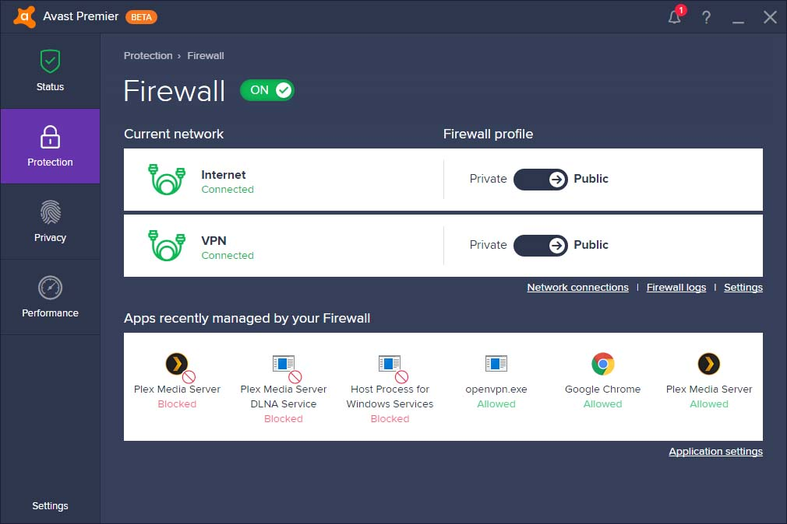
Às vezes não fornece informações claras ou suficientes sobre as atualizações ou escaneamentos em andamento, deixando o usuário incerto quanto ao progresso ou sucesso dessas atividades.

  

<h3 id="2-heurista">2- Correspondência entre o sistema e o mundo real</h3>

<i><h4>Exemplo positivo (Maps)</h4></i>
 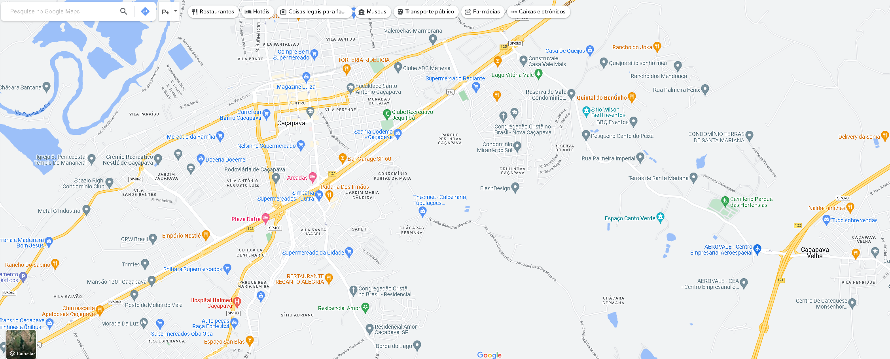
O mapa geralmente é exibido em um formato semelhante ao que o usuário encontraria em um mapa impresso, tornando-o mais familiar e fácil de entender. Além disso, as informações de navegação são apresentadas de forma clara e concisa, com ícones e símbolos que correspondem a objetos e locais do mundo real.

 

<i><h4>Exemplo negativo (PhotoShop)</h4></i>
 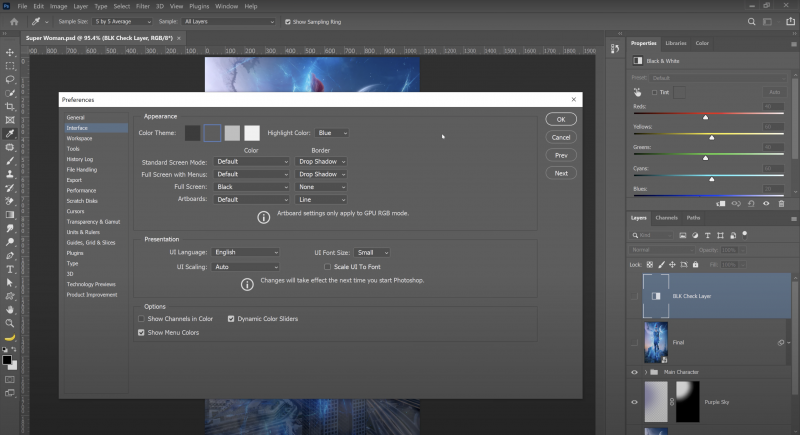
Terminologia e as opções de menu usadas no PhotoShop podem não ser intuitivas para usuários iniciantes ou aqueles que não estão familiarizados com o Photoshop. Por exemplo o uso de termos técnicos específicos como "masks" (máscaras) e "paths" (caminhos), pode ser desafiador para usuários iniciantes que não têm conhecimento prévio desses conceitos.

  

<h3 id="3-heurista">3- Controle e liberdade do usuário</h3>

<i><h4>Exemplo positivo (Word)</h4></i>
 
Recursos que permitem desfazer ações, criar e salvar várias versões de documentos e personalizar configurações de aplicativos.

  

<h3 id="4-heurista">4- Consistência e padrões</h3>

<i><h4>Exemplo positivo (Drive)</h4></i>
 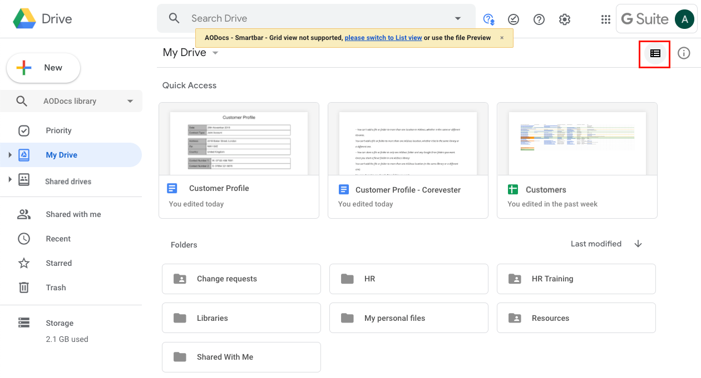
O Google Drive é um exemplo positivo de aplicação que segue essa heurística, com um layout consistente e padrões visuais claros em todas as suas funcionalidades, o que aumenta a eficiência e a satisfação do usuário.

 

<i><h4>Exemplo negativo (Adobe Premiere)</h4></i>
 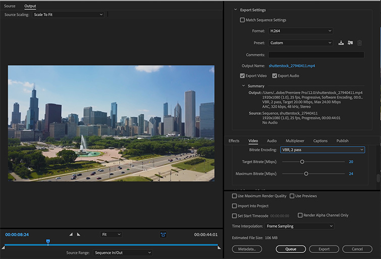
No Adobe Premiere a forma como o usuário define a taxa de quadros de um projeto pode ser bastante diferente da forma como ele define outras configurações relacionadas à exportação de um vídeo; Isso pode causar confusão e erros na produção de vídeos, pois a taxa de quadros afeta diretamente a qualidade da imagem e a fluidez da animação.

  

<h3 id="5-heurista">5- Prevenção de erros</h3>

<i><h4>Exemplo positivo (Linkedin)</h4></i>
 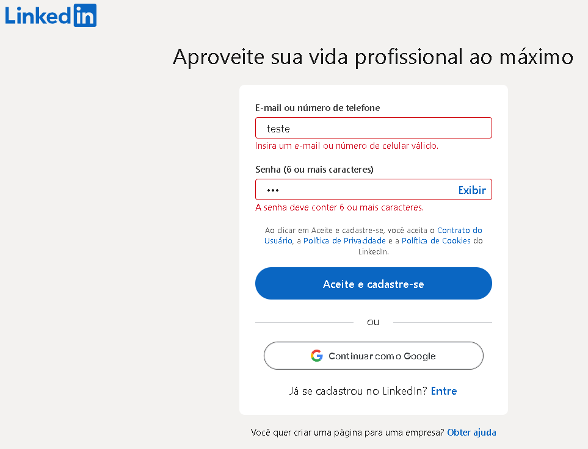
No Linkedin, se um usuário inserir uma informação inválida, um aviso será exibido ao lado do campo correspondente, evitando que o usuário prossiga com dados inconsistentes.

 

<i><h4>Exemplo negativo (Windows)</h4></i>
 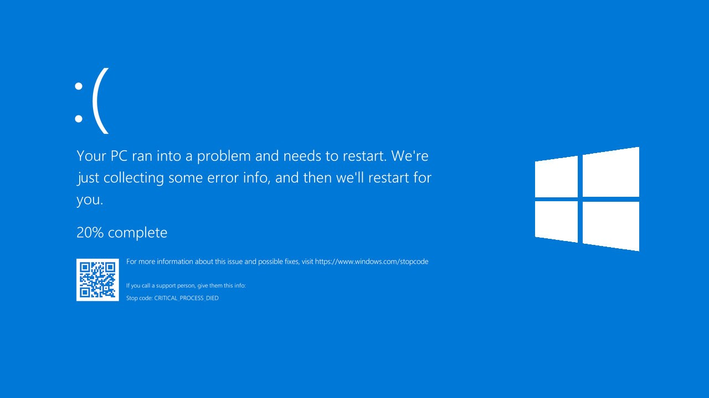
Ocorre quando o sistema operacional encontr um erro crítico e não consegue se recuperar, fazendo com que o computador trave completamente e precise reinicir. Além disso, a interface do usuário muitas vezes não forne informações claras sobre o que causou o erro.

  

<h3 id="6-heurista">6- Reconhecimento em vez de lembrança</h3>

<i><h4>Exemplo positivo (Windows)</h4></i>
 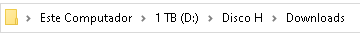
Em vez de o usuário precisar lembrar o endereço exato, é exibido o caminho percorrido.

 

<i><h4>Exemplo negativo (Bloco de Notas)</h4></i>
 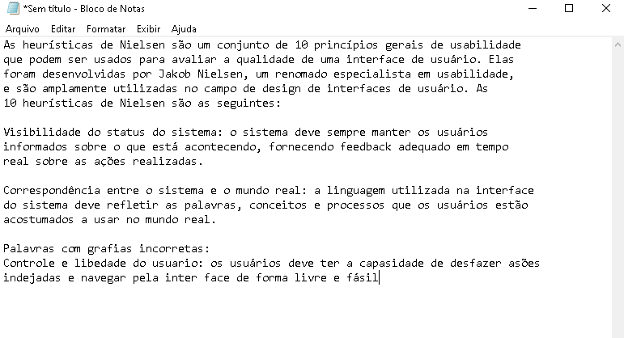
Não possui um recurso de sugestão de palavras enquanto o usuário digita. Isso exigiria que o usuário lembrasse a grafia correta de cada palavra.

  

<h3 id="7-heurista">7- Flexibilidade e eficiência de uso</h3>

<i><h4>Exemplo positivo (Notion)</h4></i>
 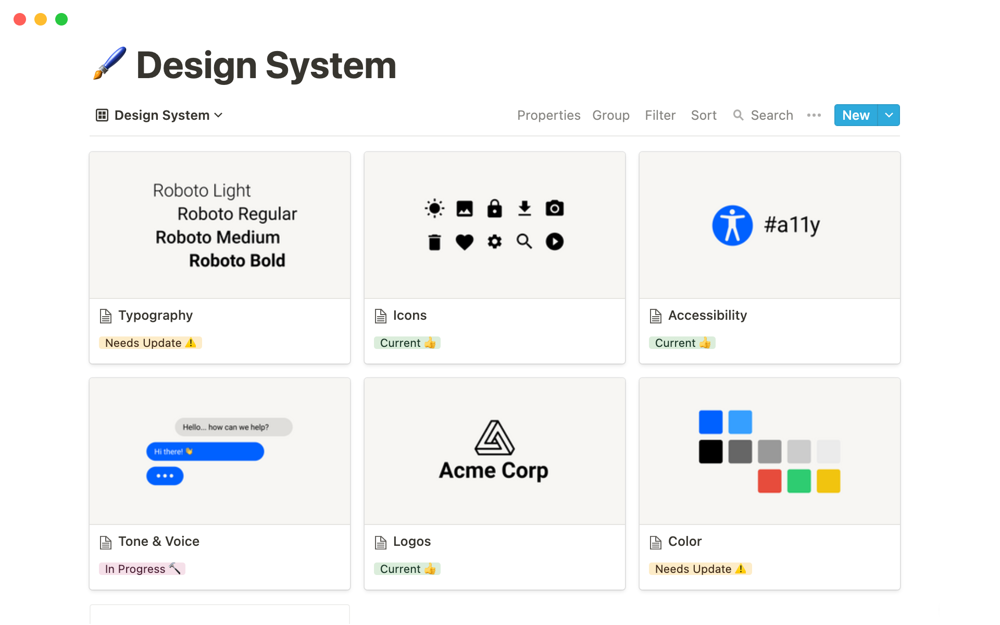
O aplicativo permite que os usuários personalizem as configurações de forma a torná-lo mais eficiente e personalizado.

 

<i><h4>Exemplo negativo (Final Cut Pro X)</h4></i>
 
Possuem muitas funcionalidades, mas não oferecem opções personalizáveis de atalhos de teclado. Isso significa que os usuários precisam clicar em muitos menus e opções para executar ações frequentes.

  

<h3 id="8-heurista">8- Estética e design minimalista</h3>

<i><h4>Exemplo positivo (Site da Apple)</h4></i>
 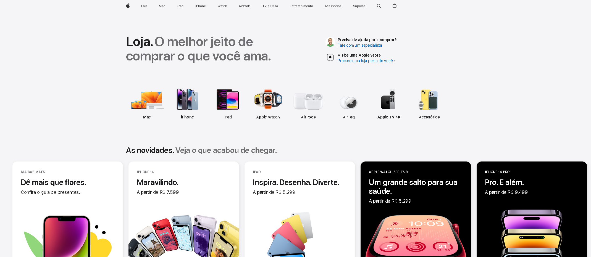
Site da empresa Apple, que utiliza uma paleta de cores simples e limpa, tipografia clara e imagens focadas no produto, resultando em um design elegante e funciona.

 

<i><h4>Exemplo negativo (Craiglist)</h4></i>
 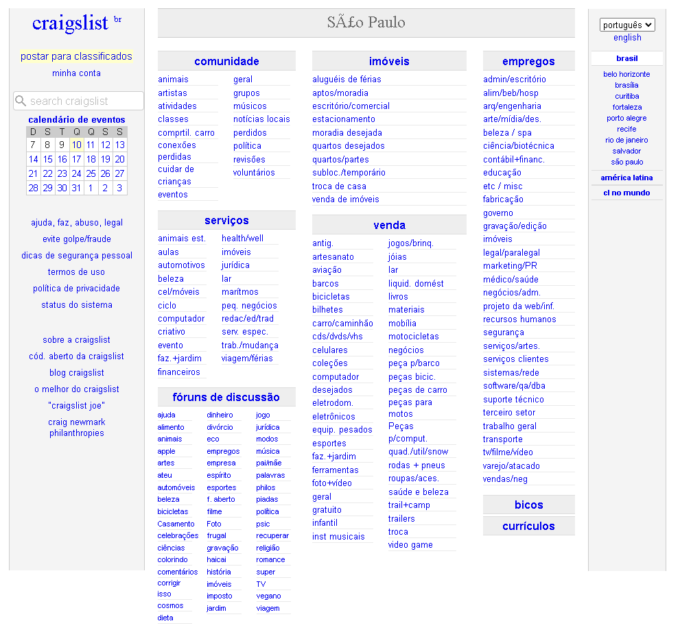
Craigslist é um site de classificados online, onde na página inicial do site tem uma grande quantidade de informações e links para várias categorias e subcategorias de anúncios.

  

<h3 id="9-heurista">9- Ajudar o usuário a reconhecer, diagnosticar e recuperar-se de erros</h3>

<i><h4>Exemplo positivo (Grammarly)</h4></i>
 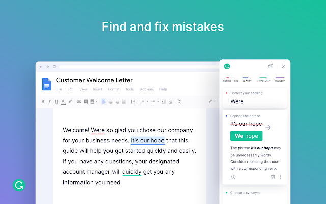
Quando um usuário digita algo que contém um erro de ortografia ou gramática, o aplicativo o sublinha em vermelho e sugere correções específicas.

  

<h3 id="10-heurista">10- Ajuda e documentação</h3>

<i><h4>Exemplo positivo (Stack Overflow)</h4></i>
 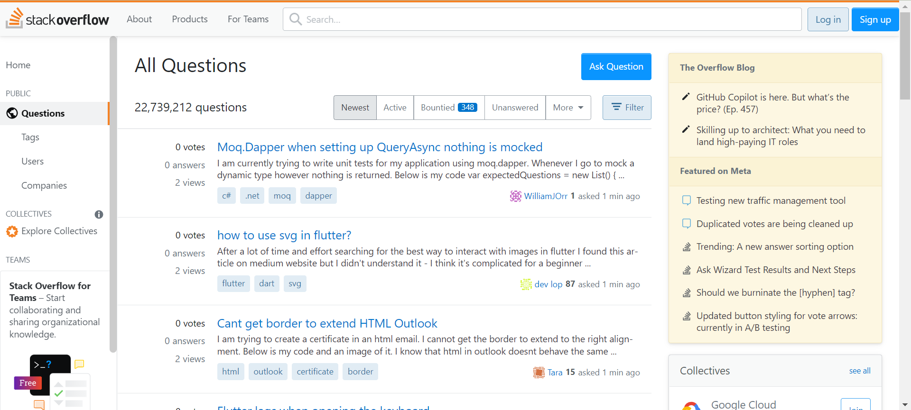
Stack Overflow é uma plataforma colaborativa de perguntas e respostas para programadores, e oferece diversas opções de ajuda e documentação, como uma seção de ajuda e um guia de como fazer uma boa pergunta.

 

<i><h4>Exemplo negativo (Discord)</h4></i>
 
Não possui uma documentação clara e objetiva sobre suas funcionalidades.

